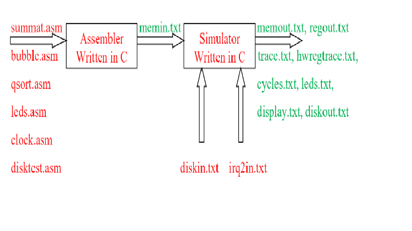

# ISA Project  (Computer Structure and Organization)
The project includes:
1. 6 programs in SIMP language, similar to assembly language
2. A C-language projects that simulates an assembler
3. A C-language project that simulates the processorׂ (SIMP -a lite version of MIPS)

Diagram that explains the design in the project

This repository contains the submitted material.
